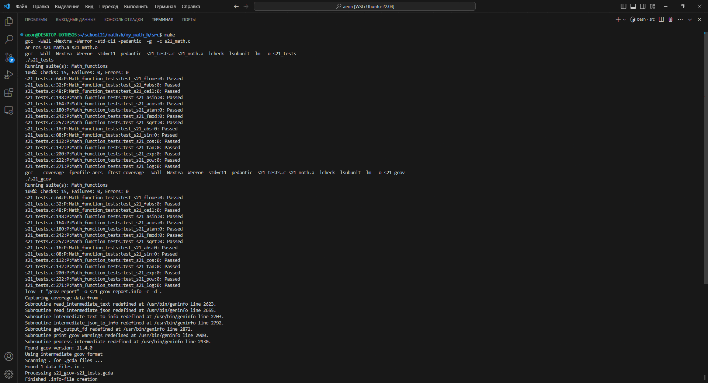

# MATH.H

## Оглавление

* [Введение](#Введение)
* [Зависимости](#Зависимости)
* [Сборка](#Сборка)
* [Тесты](#Тесты)

## Введение

Авторская реализация библиотеки math.h.  
проект представляет собой реализацию собственной версии стандартной библиотеки math.h на языке программирования C.  
Библиотека включает основные математические операции, необходимые для использования в различных алгоритмах.  

### Реализованы следующие требования к проекту

Разработано на языке C стандарта C11 с использованием компилятора gcc.  
Код библиотеки располагается в папке src в ветке разработки.  
Использован стиль разработки Google.  

Статическая библиотека реализована с заголовочным файлом s21_math.h.  
Весь код библиотеки покрыт модульными тестами с использованием библиотеки Check.  
Makefile используется для сборки библиотеки и тестов, включая цели all, clean, test, s21_math.a, gcov_report.  

### Реализованные функции  

| No. | Function | Description | Name | Status |
| --- | -------- | ----------- | ---- | ------ |
| 1 | `int abs(int x)` | вычисляет абсолютное значение целого числа | fungusgr | DONE |
| 2 | `long double acos(double x)` | вычисляет арккосинус | holdosto | DONE |
| 3 | `long double asin(double x)` | вычисляет арксинус | holdosto | DONE |
| 4 | `long double atan(double x)` | вычисляет арктангенс | holdosto | DONE |
| 5 | `long double ceil(double x)` | возвращает ближайшее целое число, не меньшее заданного значения | maggytel | DONE |
| 6 | `long double cos(double x)` | вычисляет косинус | holdosto | DONE |
| 7 | `long double exp(double x)` | возвращает значение e, возведенное в заданную степень | shanikat | DONE |
| 8 | `long double fabs(double x)` | вычисляет абсолютное значение числа с плавающей точкой | fungusgr | DONE |
| 9 | `long double floor(double x)` | возвращает ближайшее целое число, не превышающее заданное значение | maggytel | DONE |
| 10 | `long double fmod(double x, double y)` | остаток операции деления с плавающей точкой | foldeslu | DONE |
| 11 | `long double log(double x)` | вычисляет натуральный логарифм | shanikat | DONE |
| 12 | `long double pow(double base, double exp)` | возводит число в заданную степень | foldeslu | DONE |
| 13 | `long double sin(double x)` | вычисляет синус | holdosto | DONE |
| 14 | `long double sqrt(double x)` | вычисляет квадратный корень | foldeslu | DONE |
| 15 | `long double tan(double x)` | вычисляет тангенс | holdosto | DONE |

### Использование

Для использования библиотеки необходимо скомпилировать проект, включая исходный код библиотеки и модульные тесты, с помощью Makefile.    


## Зависимости  

***Для работы программы необходима установленная дбиблиотека check + утилиты lcov и gcov.***  

Проверка их наличия и установка осуществляется с помощью скрипта src/materials/scripts/check_gcov_lcov.sh командой `make check`  

<details>
  <summary>Команды для ручной установки</summary>

  | № | Ресурс   | Команда Linux                      | Команда MacOs |
  |---|----------|------------------------------------|----------------|
  | 1 | check.h: | sudo apt-get install check         | brew install check |
  | 2 | lcov:    | sudo apt-get install lcov          | brew install lcov |
  | 3 | gcov:    | sudo apt-get install gcov          | xcode-select --install |

  Также возможно понадобится

  | № | Команда Linux                      | Команда MacOs |
  |---|------------------------------------|----------------|
  | 1 | sudo apt-get update                | brew update    |
  | 2 | sudo apt-get install --fix-missing |                |

</details>

## Сборка

```
$ git clone 
$ cd
$ git switch develop  
$ make check
$ make

```


## Тесты

Модульные тесты реализованы при помощи библиотеки Check и утилиты gcov.  
Тесты сравнивают результаты работы стандартной библиотеки math с результатами s21_math.  
После отрабатывания всех тестов программа генерирует отчет gcov в форме html-страницы.  

Общая проверяемая точность составляет 16 значащих цифр.  
Проверяемая точность дробной части — до 6 знаков после запятой.  
После завершения работы программы с модульными тестами, проводится проверка на стиль и cppcheck. 


